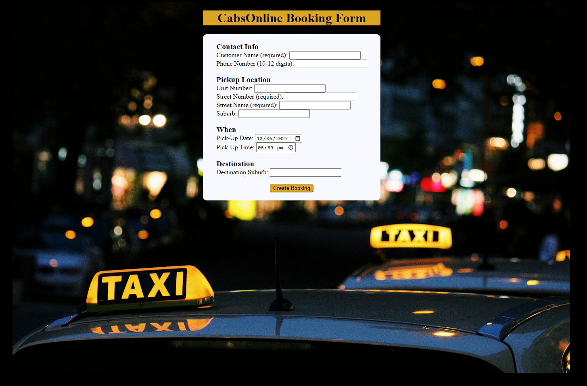
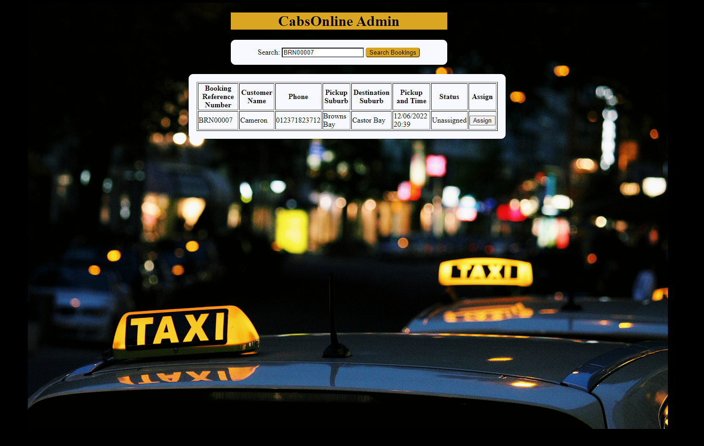

# Cabs Online
Taxi bookings service for both admin and users.

## Files Included:
- admin.html
- admin.js
- admin.php
- updateAdmin.php
- booking.html
- booking.js
- booking.php
- xhr.js

## Additional Files:
- readme.md
- sqlcommands.txt
- style.css

## Booking Form
User is required to enter a valid input into all required input fields.
On a submission with invalid values the user is prompted to fix where the error is coming from with a brief explanation of the error.
Required input fields that are invalid will have a light red colour.
Date and Time fields have the current date and time as default values.

On submission of a valid bookings the user is presented with a booking confirmation: the booking refernce number and the pickup date and time.
All booking information is sent to the database.
The form is then reset for a new booking.

## Admin Form
User is presented with a search field.
If the user leaves this field blank all unassigned bookings within the next 2 hours are shown.
User can assign themselves to a booking by clicking the 'assign' button, and is shown the confirmation message when done so.

Alternatively the user can input a booking refernce number in the input field.
If the booking exists the user is then presented with the booking associated with the search.
The user can assign themslves to the booking if the booking is yet to be assigned, otherwise the assign button will not be available to click.

## Example of usage

